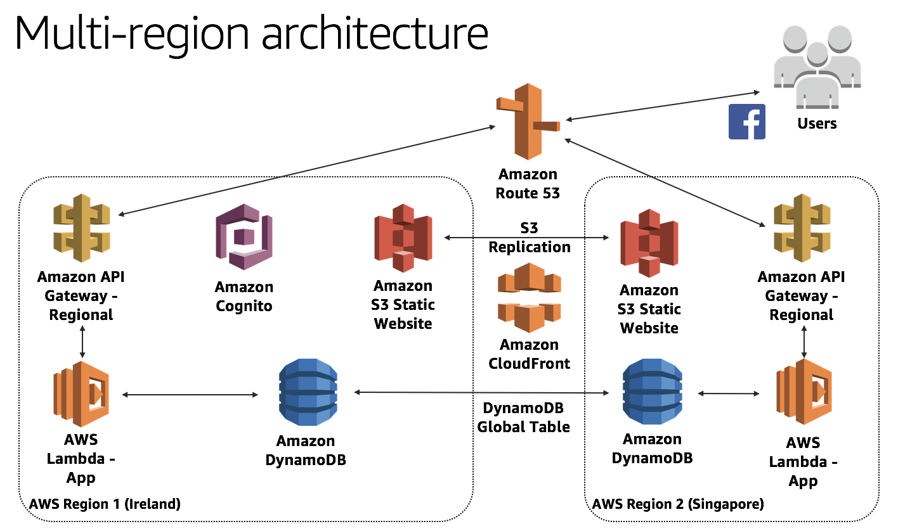
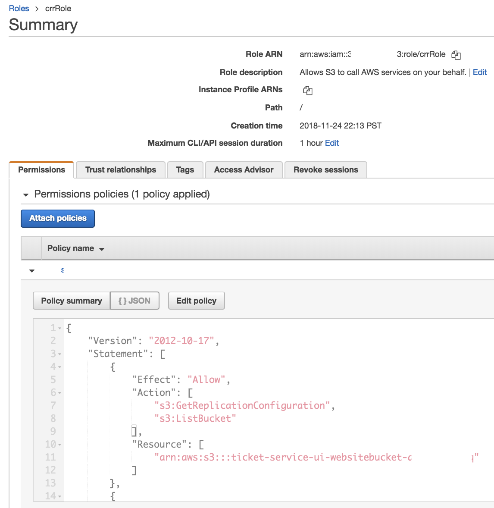
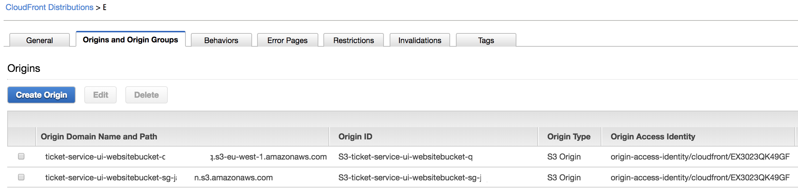
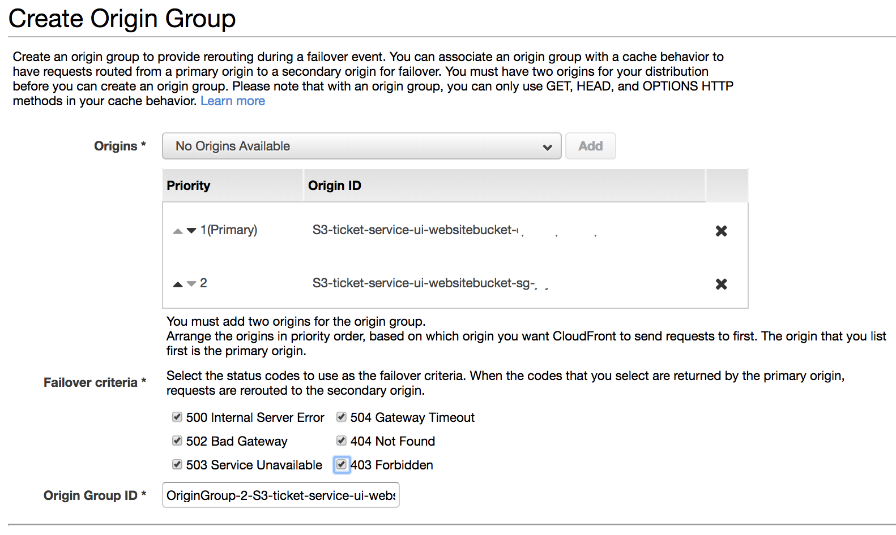

# S3 Replication and CloudFront with Multi-Region S3 Origins
This is an optional lab which will configure S3 cross region replication and CloudFront Custom Domain Name. 

During the workshop, we focused on the application replication using API Gateway, Lambda and DynamoDB, but do not address replication of the website UI layer itself to a second region.

This module provides how you achieve the Web UI layer replication using **S3 Cross Region Replication** and **CloudFront Origin Failover**. It is optional module that you can try if you have enough time in the workshop or explore later. 

This application is still not fully active-active multi-region solution as AWS Cognito exists only in the primary region (Ireland). We will continue to iterate and improve the full stack after Re:Invent. 

## S3 Cross-Region Replication (CRR)

We can replicate objects in S3 bucket to other regions for regionally distributed computing, minimize latency for users in different geographic locations, or maintain copies of objects under different ownership. When using Amazon S3 to host static websites, a good way to serve data from regions is to use [Cross-Region Replication]](https://docs.aws.amazon.com/AmazonS3/latest/dev/crr.html).

Cross-region replication (CRR) enables automatic, asynchronous copying of objects across buckets in different AWS Regions. To set up CRR when the source and destination buckets are owned by the same AWS account with the AWS CLI, you create source and destination buckets, enable versioning on the buckets, create an IAM role that gives Amazon S3 permission to replicate objects, and add the replication configuration to the source bucket. 

1.Enable versioning on your source bucket in Ireland region: 

    aws s3api put-bucket-versioning \
	--bucket <source bucket name. ex) ticket-service-ui-websitebucket-firstname-lastname> \
	--versioning-configuration Status=Enabled
	
2.Create a destination bucket and enable versioning on it. 

    aws s3api create-bucket \
	--bucket <destination bucket name. ex) ticket-service-ui-websitebucket-singapore-firstname-lastname> \
	--region ap-southeast-1 \
	--create-bucket-configuration LocationConstraint=ap-southeast-1

    aws s3api put-bucket-versioning \
	--bucket <destination bucket name. ex) ticket-service-ui-websitebucket-singapore-firstname-lastname> \
	--versioning-configuration Status=Enabled 

3.Create an IAM role. You specify this role in the replication configuration that you add to the source bucket later. Amazon S3 assumes this role to replicate objects on your behalf. You create an IAM role and attach a permissions policy to the role.

If you want to use the CLI to create a role in your Cloud9 enviroment, you need to use AWS managed temporary credentials. 

Go to **IAM** and **Create role** with **S3** service. Then click the **Create Policy** with the following policy, **crrRolePolicy**: (Don't forget to change the Source and Destination bucket names)

    {  
      "Version":"2012-10-17",
      "Statement":[
            {
              "Effect":"Allow",
              "Action":[
                  "s3:GetObjectVersionForReplication",
                  "s3:GetObjectVersionAcl"
              ],
              "Resource":[
                  "arn:aws:s3:::<source-bucket>/*"
              ]
            },
            {
          "Effect":"Allow",
              "Action":[
                  "s3:ListBucket",
                  "s3:GetReplicationConfiguration"
              ],
              "Resource":[
                  "arn:aws:s3:::<source-bucket>"
              ]
            },
            {
              "Effect":"Allow",
              "Action":[
                  "s3:ReplicateObject",
                  "s3:ReplicateDelete",
                  "s3:ReplicateTags",
                  "s3:GetObjectVersionTagging"
              ],
              "Resource":"arn:aws:s3:::<destination-bucket>/*"
            }
          ]
      }

Attach a permissions policy to the role, **crrRole**. 

Add replication configuration to the source bucket. Save the following JSON in a file called replication.json to the local directory on your Cloud9 environment. Update the JSON by providing values for the **destination-bucket** and **IAM-role-ARN** that you created above. Save the changes.

    {  
      "Role":"<IAM-role-ARN>",
      "Rules":[
            {
              "Prefix":"",
              "Status": "Enabled",
              "Destination": {
                "Bucket": "arn:aws:s3:::<destination-bucket>"
              }
            }
          ]
      }

Run the following command to add the replication configuration to your source bucket. Be sure to provide source-bucket name. 

    aws s3api put-bucket-replication \
	--replication-configuration file://replication.json \
	--bucket <source bucket name>

However, as S3 doesn't replicate objects retroactively, you need to update the Web UI bucket in source region (Ireland) to replicate objects to the destination bucket in Singapore.

Build you app with by running `npm run build` and upload the UI to the S3 website bucket again to update objects for the replication:

    aws s3 sync --delete dist/ s3://[bucket_name]

Now, you can verify your source bucket objects in Ireland region are replicated to the destination bucket in Singapore region.

## CloudFront Origin Failover

We also need additional configuration on CloudFront when we use the CloudFront with S3 origin for HTTPS on your domain. From Nov 20, you can enable Origin Failover for your CloudFront distributions to improve the availability of content delivered to your end users.

With CloudFront’s Origin Failover capability, you can setup two origins for your distributions - primary (Ireland) and secondary (Singapore), such that your content is served from your secondary origin if CloudFront detects that your primary origin is unavailable. For example, you can have two Amazon S3 buckets that serve as your origin, that you independently upload your content to. If an object that CloudFront requests from your primary bucket is not present or if connection to your primary bucket times-out, CloudFront will request the object from your secondary bucket. So, you can configure CloudFront to trigger a failover in response to either HTTP 4xx or 5xx status codes.

To get started, create the second origin with the same OAI (Origin Access Identity) of the primary origin. You can choose the S3 bucket in the second region (Singapore) that you created above for the Origin Domain Name.

Next, create an origin group in which you designate a primary origin for CloudFront plus a second origin that CloudFront automatically switches to when the primary origin returns specific HTTP status code failure responses.

If you need to remove a file from CloudFront edge caches before it expires, you can do Invalidate the file from edge caches:

    aws cloudfront create-invalidation --distribution-id <value> --paths /

## Test CloudFront Failover

To test the CloudFront Failover, you can delete the S3 bucket (or objects) in primary (Ireland) region. 

*Note.* As you configured the S3 replication, you need to specify the Filter element in a replication configuration rule or delete with specifying an object version ID not to delete the objects in the destination bucket (Singapore).

You can check the multi-region active-active ticketing system works perfectly though the primary region (Ireland) has an issue in S3 or API gateway. 

# CloudFront Custom Domain Name - Alternate Domain Name with SSL Certificate

Currently, our web application is using cloudfront.net domain name (eg: https://d111111abcdef8.cloudfront.net). Let's configure it to use our own domain name  (eg: www.example.com). 
To achieve this we need to the following:
* Request for a new SSL certification from ACM
* Configure CloudFront Distribution with Alternative Domain name and use this SSL certificate
* Update Route53 with an alias recordset
* Update Facebook application to use the new domain name

## Request a SSL Certificate for the web application
Launch [AWS Certificate Manager console](https://console.aws.amazon.com/acm/home?region=us-east-1#/) in `us-east-1`. Click on `Request a certificate` and select `Request a public certificate`. Enter your domain name for the web application (eg: www.example.com) and click `Next`. Select `DNS validation` and `Review` followed by `Confirm and request`. In the Validation page, expand on the domain name and click on `Create record in Route 53`. This will populate your Route53 hosted zone with the CNAME record to validate this domain name.

## Edit CloudFront Distribution 
Launch the [CloudFront console](https://console.aws.amazon.com/cloudfront/home#distributions:) and select the CloudFront distribution created in Module 2.

To add Alternate Domain Name and SSL Certificate:
* Click on `Edit`
* Enter a domain name under `Alternate Domain Names`, eg: `www.example.com` , (substituting your own domain)
*  Select Custom SSL Certificate, and in the input box below, select the Custom SSL Certificate that was created above.
* Click `Yes, Edit` to save the configuration

## Update Route53
* Launch [Route53 Console] (https://console.aws.amazon.com/route53/home#hosted-zones:) and select your Hosted Zone.
* Click `Create Record Set` and specific the following: **Name** : `www.example.com`  (substituting your own domain name), **Type** : Choose `A – IPv4 address`, **Alias**: Choose `Yes`, **Alias Target**: Choose the CloudFront distribution for the web application. **Routing Policy**: Select `Simple` and **Evaluate Target Health**: `No`
* Choose `Create`

**Important**:You should be able to launch your web application using the new domain name. Take note to update Facebook App's `App Domains` and `Site URL` so that Facebook login will work with the new domain name.

# Clean Up
To prevent further AWS charges, please clean-up the AWS resources created in this workshop by following the [steps here.](../5_Cleanup/README.md)

