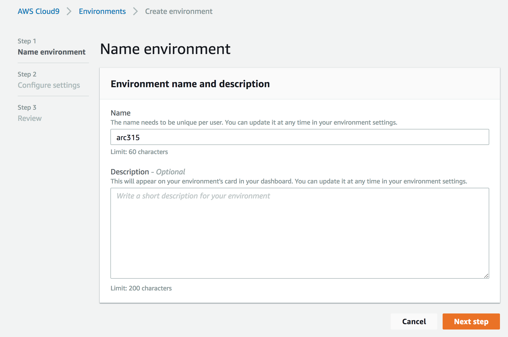
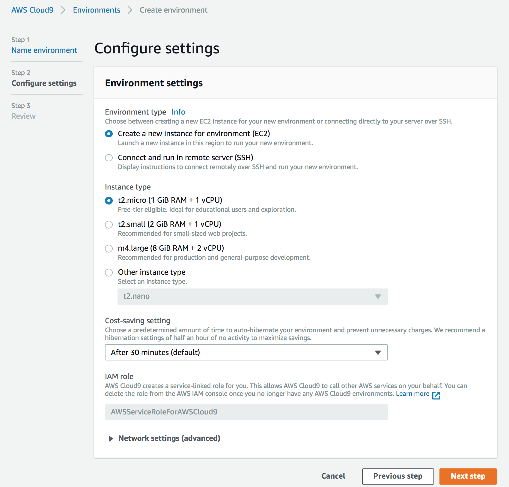
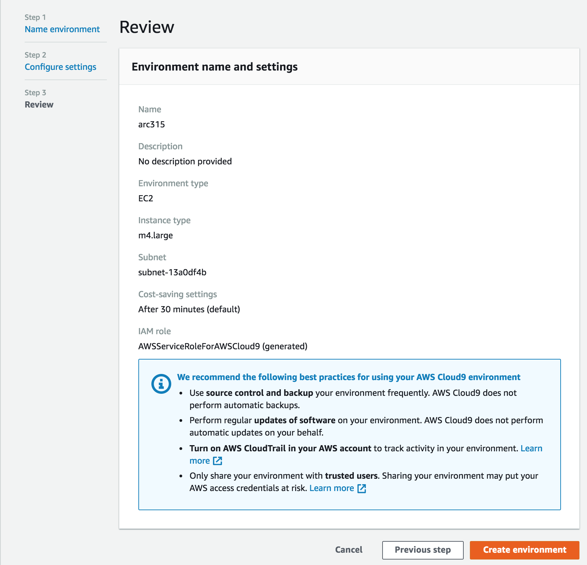
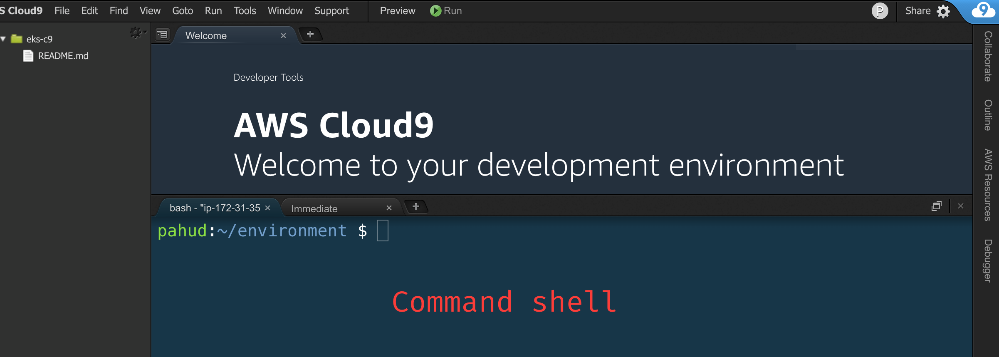

# AWS Cloud9 - Cloud IDE


Login to AWS Console, select *eu-west-1 Region* and spin up a AWS Cloud9 environment.

https://eu-west-1.console.aws.amazon.com/cloud9/home?region=eu-west-1 


Name your AWS Cloud9 Environment


AWS Cloud9 is free, you only pay for the underlying EC2 instance. Select your EC2 instance type. We can use t2.micro for this lab. To save cost, AWS Cloud9 will spin down the EC2 when you are not using it.



Click "Create envivironment" and AWS Cloud9 will start! It would typically take 30-60s to create your AWS Cloud9 environment.


## Install node and npm 



Once AWS Cloud9 is up and running, execute these 2 commands in the command shell of Cloud9. This is required for our AngularJS front end.

```bash
nvm install 8.9.1

nvm use v8.9.1

```

verify that you have the right `node` and `npm` :

```bash
enghwa:~/environment $ npm -v
5.5.1
enghwa:~/environment $ node -v
v8.9.1
```
[Go back](README.md) or
Start the lab: [Build an API layer](1_API/README.md)
